El uso del control de versiones es obligatorio cuando se trabaja de manera colectiva y se quiere controlar el flujo de trabajo y el seguimiento de los cambios en el mismo. Incluso, para trabajar de manera individual, es deseable mantener vigilados los cambios realizados a un documento importante. 
RStudio trabaja bastante bien con Git (recordando que utilizaremos Github para hospedar nuestros archivos). Así que comencemos. 


## Requisitos
Debemos descargar Git desde [Descargas](https://git-scm.com/downloads). Lo instalamos. Ahora bajamos e instalamos RStudio desde [Descargas](https://www.rstudio.com/products/rstudio/download/), cuidando que sea obviamente la versión deseada. Lo ejecutamos enseguida.


## Creando una cuenta en GitHub
Ahora nos dirigimos a [GitHub](https://github.com) y nos creamos una cuenta dando clic en el botón _Sign up_ que se encuentra al lado superior derecho: 
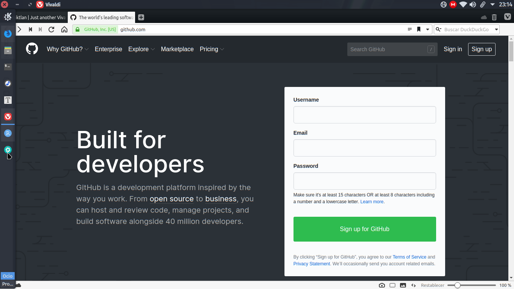


Nos pedirán un nombre de usuario, una dirección de correo y la contraseña. Abajo de todo, existe un paso de verificación de cuenta, solo hay que aprobarlo:
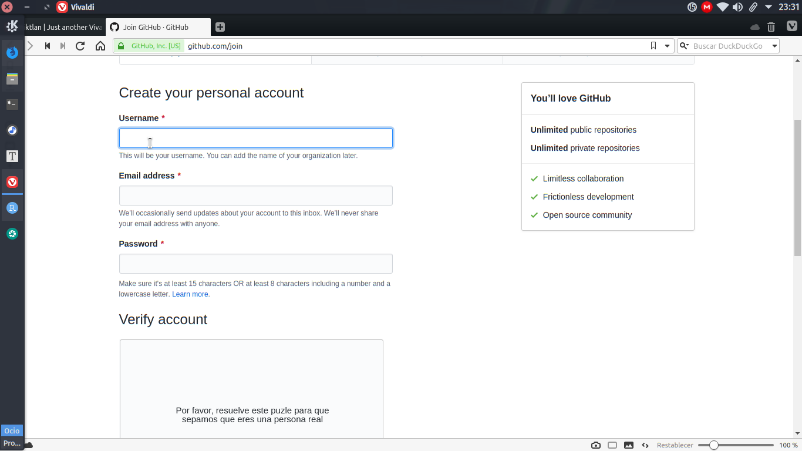


Ahora toca decirle a Git quiénes somos en GitHub. En RStudio nos vamos a _Tools -> Shell_ y escribimos en la nueva ventana que saldrá, lo siguiente:

```
git config --global user.email "nombre_correo@company.com"
git config --global user.name "TuNombreEnGithub"
```

Listo.


## Creando un repositorio
En la página de GitHub.com, ya autentificados, nos dirigimos al signo '+' que se encuentra al lado superior derecho de la pantalla. Damos clic allí y luego en _New Repository_. 
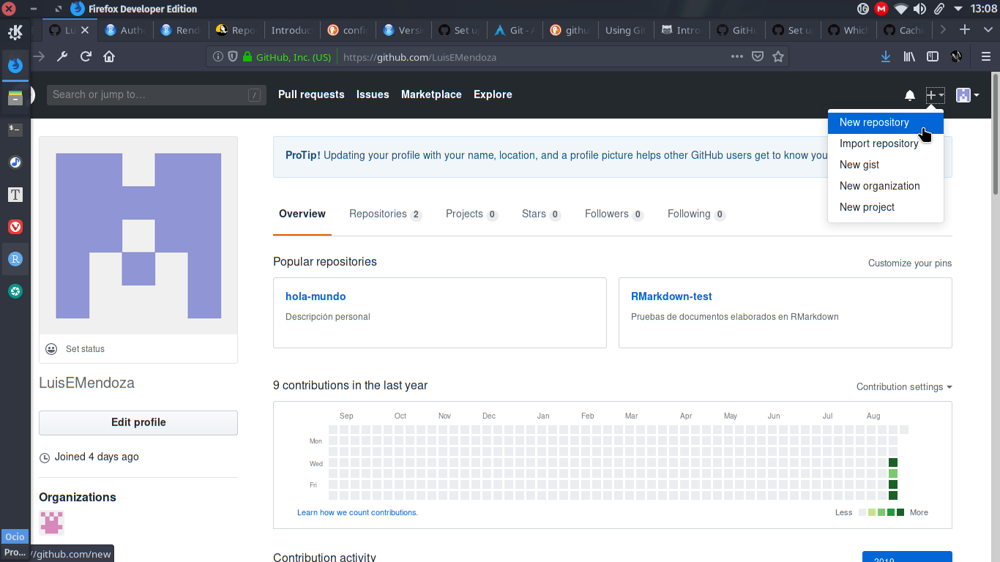


Le ponemos el nombre que deseemos, le damos una descripción adecuada, lo dejamos público, damos _check_ a _Initialize this repository with a README_. Damos clic en el botón _Add .gitignore_ y escribimos _R_. Damos clic en el siguiente botón _Add license_ y seleccionamos _GNU General Public License v3.0_ y presionamos _Create repository_.
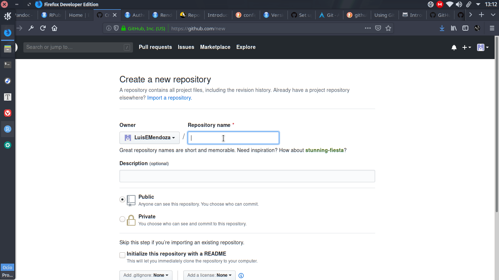


## Clonando el repositorio

1. En nuestra página GitHub, damos clic a nuestro repositorio a clonar.
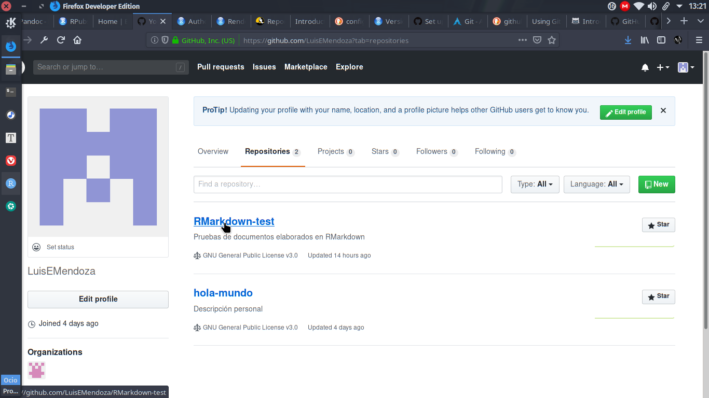


2. En la pestaña _Code_ localizamos el botón verde _Clone or download_.
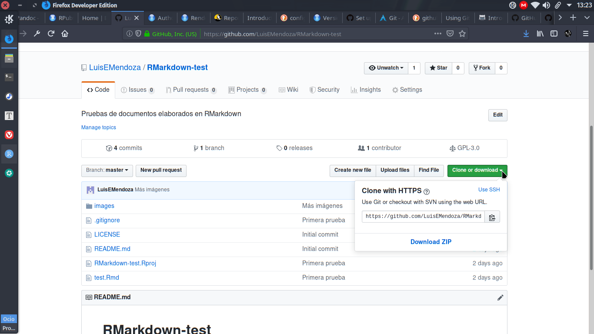


3. Damos clic en el botón _Copy to clipboard_ para copiar la dirección del repositorio.
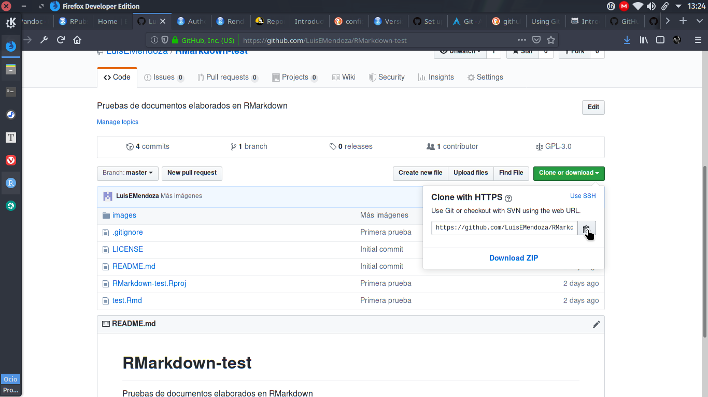


4. Ejecutamos RStudio y damos clic en _File -> New Project -> Version Control -> Git_. Pegamos la dirección copiada en _Repository URL_, presionamos `tab` para asegurarnos de que se ponga el nombre original del repositorio y presionamos _Create project_.
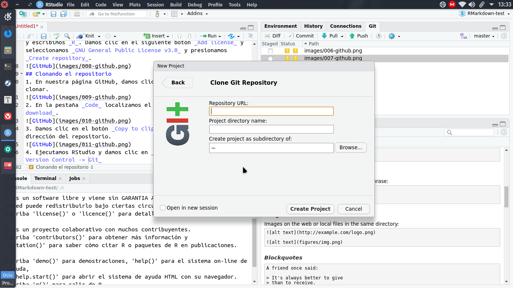


## Creando el primer documento RMarkdown
1. Con el proyecto creado y sin haber salido de RStudio, damos clic en _File -> New File -> RMarkdown_.
2. Elegimos _HTML_ como salida por defecto.
3. Guardamos el archivo en _File -> Save_.
4. Ponemos un nombre adecuado (por ejemplo, _test_) y guardamos.


## Consolidar y empujar los cambios a GitHub
1. Con nuestro archivo guardado, es momento de «consolidar». Para ello, nos dirigimos a la pestaña _Git_ que se encuentra en el panel superior derecho:
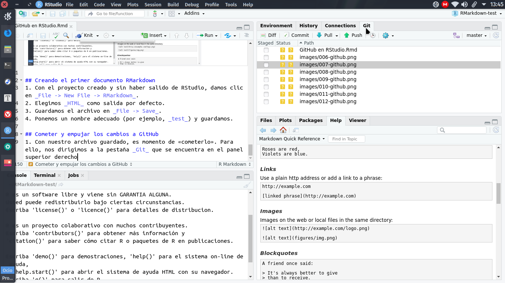


2. Presionamos _Commit_.
3. En la ventana _Review Changes_ seleccionamos todos los archivos mostrados.Todos deberán cambiar su _status_ a una letra A de color verde. Agregamos un mensaje al _commit_ y presionamos el botón _Commit_:
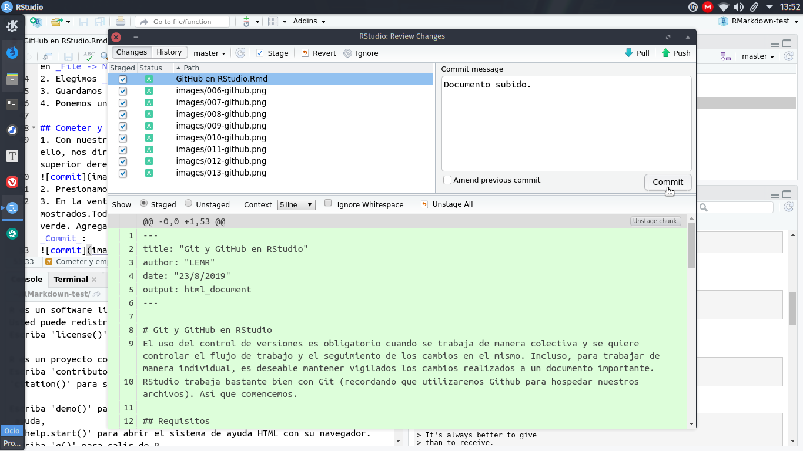


4. Después de un pequeño lapso, se mostrará una ventana con algunos mensajes. La cerramos con el botón _Close_.
5. Presionamos _Pull_ en la ventana _Review Changes_ que queda, esto es para «jalar» los cambios hechos en el repositorio de manera remota. Esperamos a que aparezca otra ventana y el mensaje «Ya está actualizado» y la cerramos con _Close_.
6. Ahora presionamos _Push_ para «empujar» nuestros cambios hechos recientemente al repositorio. Aquí Git nos pedirá el nombre de usuario y la contraseña de la cuenta. Podremos cerrar la ventana cuando aparezca el botón _Close_.
7. Ahora hay que dirigirnos a nuestro repositorio GitHub para verificar los cambios realizados.


## Guardar en caché nuestras credenciales de GitHub
Cada vez que empujemos nuestros cambios a GitHub, éste nos pedirá nuestro nombre de usuario y contraseña. Si no queremos escribirlas cada vez, podemos almacenarlas de manera temporal en la caché. 
1. Para Windows, se instala _Git for Windows_ desde [](https://gitforwindows.org/) y se escribe en esa aplicación lo siguiente: 

```
$ git config --global credential.helper wincred
``` 

2. Para Linux, en la terminal se ejecuta lo siguiente:

```
$ git config --global credential.helper cache
```


## Creando ramas localmente
Un concepto intrínseco en GitHub es el uso de ramas, las cuales permiten desarrollar el proyecto principal en instancias separadas. Así, los cambios realizados no se reflejan en él de inmediato, si no que se someten a revisión cuando una de las ramas se considera terminada. Cuando los cambios hechos en una rama se consideran lo adecuados para implementarse en el proyecto principal, se realiza una petición _pull_. Al aprobarse, converge en la rama principal, que se llama _Master_.
Para crearlas a través de RStudio:
1. Nos dirigimos al panel inferior izquierdo, damos clic a la pestaña _Terminal_ y escribimos: 

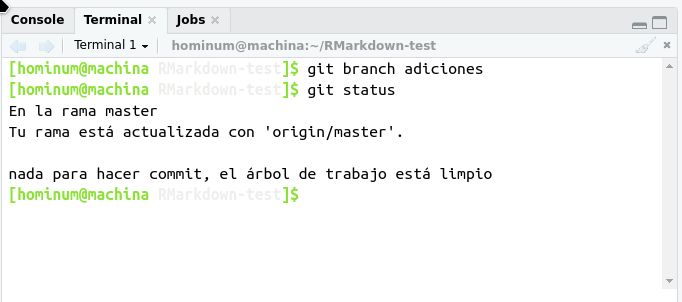


```
git branch NombreDeRama
```

2. Verificamos el estado del repositorio:
```
git status
```

Es importante notar que solo creamos la rama, no estamos dentro de ella (aún seguimos en la rama Master).
3. Para dirigirnos a la rama recién creada, escribimos:

```
git checkout NombreDeRama
```

4. Volvemos a verificar el estado del repositorio, para que nos indique si ya estamos en la rama nueva:

```
git status
```


## Haciendo cambios locales con Git
Generemos la salida HTML de nuestro documento RMarkdown en un directorio separado llamado _docs_. Para lograrlo:

1. Creamos un nuevo directorio llamado _docs_ en el panel inferior derecho de RStudio.
2. Abrimos y agregamos al inicio del documento, justo después del campo _tittle_


```
knit: (function(input_file, encoding) {
  out_dir <- 'docs';
  rmarkdown::render(input_file,
 encoding=encoding,
 output_file=file.path(dirname(input_file), out_dir, 'index.html'))})
 ```

3. Guardamos el archivo.

4. Damos clic en el botón _Knit_ que se encuentra en el panel donde estamos editando nuestro documento. Se generará el archivo HTML. Podremos ahora visualizarlo en su forma final.


## Consolidar cambios locales con Git
Con el archivo HTML generado, es momento de consolidar los cambios.

1. Determinar el estado del archivo:

```
git status
```

El archivo deberá encontrarse dentro de los archivos sin seguimiento.

2. Para agregar el archivo al seguimiento, escribe:

```
git add . 
```

3. Verifica el estado. El archivo ahora debe estar dentro de los cambios a ser confirmados:

```
git status
```

4. Consolida el archivo. No olvides incluir un comentario de consolidación adecuado:

```
git commit -m "Salida HTML a un directorio de documentos"
```

5. Para poder ver una historia de consolidaciones, puedes escribir:

```
git log --oneline
```

6. Para poder ver los cambios entre la rama master y la rama nueva:

```
git diff --stat --summary master..NombreDeRama
```


## Abrir una petición pull en GitHub
Es momento de empujar los cambios:
1. Empuja los cambios al repositorio remoto:

```
git push -u origin NombreDeRama
```

2. Creamos una petición pull en el sitio de GitHub, para ello, vamos al repositorio y veremos en la pantalla principal la rama que se acaba de empujar y a su lado, un botón verde con la leyenda _Compare & Pull Request_. Presionamos dicho botón.
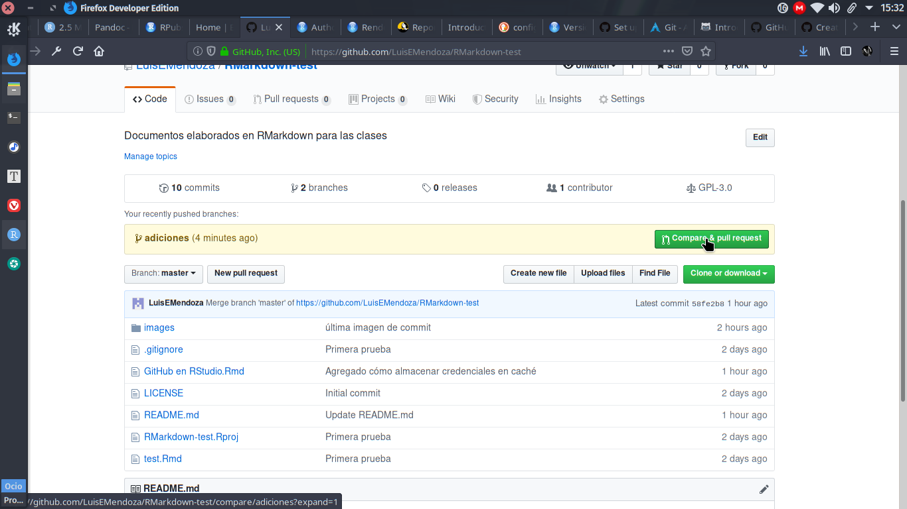


Si este aviso no aparece (usualmente ocurre cuando estamos editando muy rápido nuestro repositorio), tendremos que ir justo debajo de donde debió aparecer el aviso. Damos clic en el botón que dice "Branch:master" y seleccionamos el nombre de nuestra rama en el desplegable. Enseguida damos clic en el botón "New pull request".

Aparece una pantalla en la que debemos llenar con datos de la petición. Debemos asegurarnos de que en la parte superior sí esté seleccionada la base como master y compare como el nombre de nuestra rama. Presionamos el botón _Create Pull Request_.


## Converge la pull request en GitHub
En GitHub nos dirigimos a la pestaña _Pull Requests_ de nuestro repositorio. Bajamos y damos clic en el botón verde _Merge Pull Request_. Confirmamos dando clic en el botón _Confirm merge_ y borramos la rama nueva, si lo deseamos.


## Creando la página del sitio
Ahora queremos publicar este documento en formato HTML como la página del sitio. Hay que realizar los siguientes pasos:

1. Entrar a la pestaña _Settings_ del repositorio.
2. Bajar hasta la sección _GitHub Pages_.
3. En _Source_ dar clic en el botón desplegable que dice _None_ y seleccionar _master branch/docs folder_.
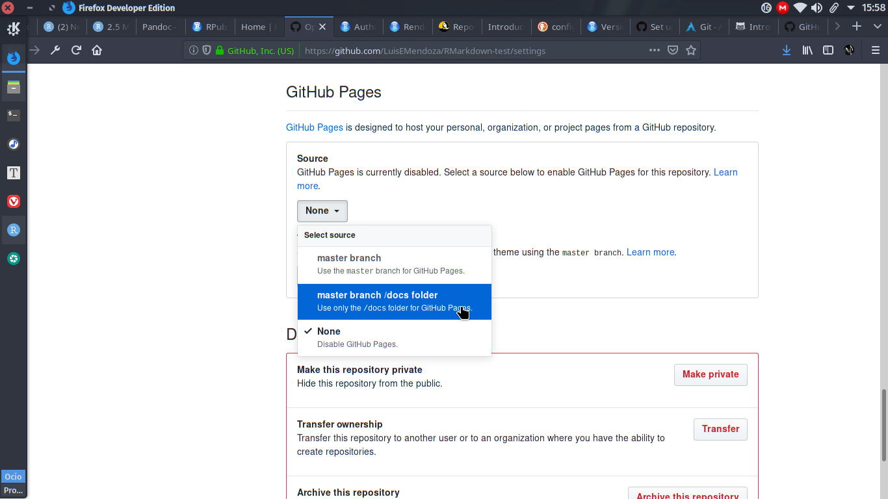


4. Aparecerá un mensaje en la misma sección _GitHub Pages_ diciendo que el sitio ha sido publicado en una dirección con dominio _github.io_.

5. Damos clic en el sitio mostrado para poder acceder a nuestra página.


## Actualiza el repositorio local
Después de haber unido las ramas del proyecto, toca actualizar el repositorio local, es decir, la computadora en la que se está trabajando.

1. En la terminal de RStudio, escribir

```
git checkout master
```

2. Enseguida escribir

```
git pull
```

3. Borramos la rama local:

```
git branch -D adiciones
```

4. Podemos ver la historia de nuestras modificaciones mediante

```
git log --oneline --graph --all
```

## Agregando funcionalidad a nuestra página
Agregaremos una página de bienvenida y navegación a nuestro sitio github.io.

1. Creamos una nueva rama llamada _theme_.

```
git branch theme
```

2. Entramos en ella:

```
git checkout theme
```

3. Agregamos un archivo _\_site.yml_ con el siguiente contenido:

```
name: "cars"
output_dir: "docs"
navbar:
  title: "Cars"
  left:
  - text: "Home"
    href: index.html
  - text: "Speed and Distance"
    href: speed-and-distance.html
output:
  html_document:
    theme: cosmo
 ```
 
 4. Agrega otro documento RMarkdown llamado _index.rmd_. Será la página de bienvenida.
 
 5. En el documento original que estuvimos elaborando, nos vamos al inicio y borramos los campos _knit_ y _output_, quedando solamente el _title_ como único obligatorio.
 
 6. Guardamos los cambios.
 
 7. Ejecutamos lo siguiente en la terminal de RStudio:
 
 ```
 rmarkdown::render_site()
 ```
 
 8. Consolidamos los cambios con Git.
 
 9. Abrimos la _pull request_ y la convergemos.
 
 10. Verificamos nuestro sitio.